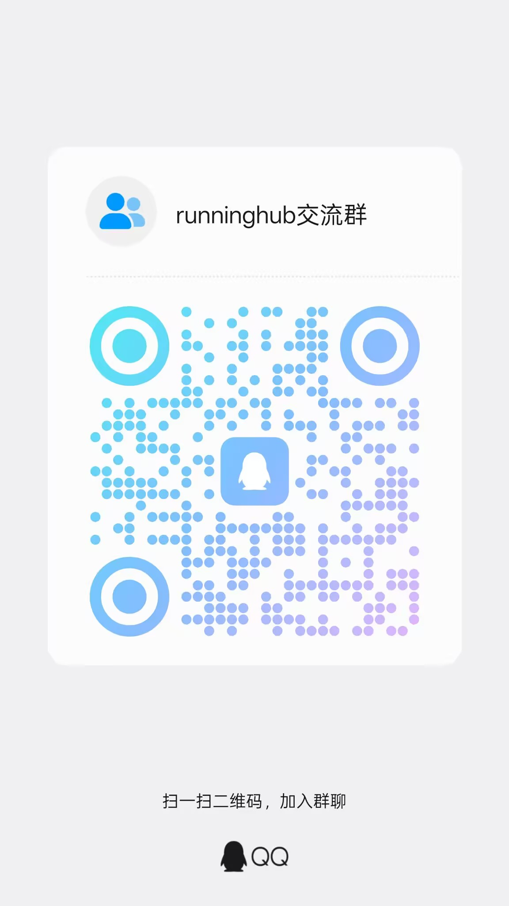

# RunningHub ComfyUI SDK

`runninghub-sdk` 是一个面向 RunningHub ComfyUI OpenAPI 的 Python SDK，支持任务创建、状态轮询、结果查询、文件上传，以及用链式 NodeModifier 修改工作流节点参数。

当前版本也支持 RunningHub AI App 接口，包括获取 AI App 可调用节点示例和直接发起 AI App 任务。

这个子目录可以直接作为 Python 包发布根目录使用，也可以单独进入目录后执行构建和上传命令发布到 PyPI。


## 特性

- 同时支持同步和异步调用
- 基于 `httpx`，接口简单，依赖精简
- 提供完整类型注解，适合 IDE 自动补全
- 支持 `NodeModifier` 链式修改节点输入
- 支持图片、视频、音频、LoRA 等文件上传
- 支持自动轮询等待任务完成

## 安装

```bash
pip install runninghub-sdk
```

如果你是在本仓库中本地开发，也可以进入 `runninghub_sdk` 目录后安装开发依赖：

```bash
pip install -e .[dev]
```

## 快速开始

### 同步调用

```python
from runninghub_sdk import RunningHubClient, modify_nodes

with RunningHubClient(api_key="your-api-key") as client:
    modifier = (
        modify_nodes()
        .text("6", "a cinematic sunset over the sea")
        .seed("3", 12345)
        .steps("3", 25)
    )

    task = client.run_with_modifier("workflow-id", modifier)
    outputs = client.wait_for_completion(task.task_id)

    for output in outputs:
        print(output.file_url)
```

### 异步调用

```python
import asyncio

from runninghub_sdk import RunningHubClient, modify_nodes


async def main() -> None:
    async with RunningHubClient(api_key="your-api-key") as client:
        modifier = modify_nodes().text("6", "a beautiful landscape")
        task = await client.async_run_with_modifier("workflow-id", modifier)
        outputs = await client.async_wait_for_completion(task.task_id)

        for output in outputs:
            print(output.file_url)


asyncio.run(main())
```

## 核心能力

### AI App 接口

| 同步方法 | 异步方法 | 说明 |
|---------|---------|------|
| `get_ai_app_api_demo()` | `async_get_ai_app_api_demo()` | 获取 AI App 调用示例、节点信息、封面和标签 |
| `run_ai_app()` | `async_run_ai_app()` | 发起 AI App 任务 |
| `run_ai_app_with_modifier()` | `async_run_ai_app_with_modifier()` | 使用修改器发起 AI App 任务 |
| `list_public_models()` | `async_list_public_models()` | 获取公共模型列表，支持类型、名称、基础模型、标签分页筛选 |
| `run_model_api()` | `async_run_model_api()` | 通用标准模型 API 调用，适用于图像、视频、音频、3D 等标准模型端点 |
| `preview_model_price()` | `async_preview_model_price()` | 按实际请求参数预估标准模型调用价格 |
| `wait_for_query_v2_completion()` | `async_wait_for_query_v2_completion()` | 基于 `/openapi/v2/query` 轮询标准模型任务完成 |

### 账户与调试接口

| 同步方法 | 异步方法 | 说明 |
|---------|---------|------|
| `get_account_status()` | `async_get_account_status()` | 获取账户信息，包括余额、当前任务数、API 类型 |
| `list_api_keys()` | `async_list_api_keys()` | 查询 API Key 列表 |
| `get_queue_status()` | `async_get_queue_status()` | 查询当前 API Key 的队列状态 |
| `validate_api_key()` | `async_validate_api_key()` | 通过队列状态接口验证当前 API Key 是否有效 |
| `get_webhook_detail()` | `async_get_webhook_detail()` | 根据任务 ID 查询 webhook 事件详情 |
| `retry_webhook()` | `async_retry_webhook()` | 重新发送指定 webhook 事件 |

### 任务接口

| 同步方法 | 异步方法 | 说明 |
|---------|---------|------|
| `run()` | `async_run()` | 发起任务 |
| `run_with_modifier()` | `async_run_with_modifier()` | 使用修改器发起任务 |
| `get_status()` | `async_get_status()` | 查询任务状态 |
| `get_outputs()` | `async_get_outputs()` | 查询任务输出 |
| `wait_for_completion()` | `async_wait_for_completion()` | 轮询直到任务完成 |
| `query_v2()` | `async_query_v2()` | 调用 V2 查询接口 |

### 文件上传

| 同步方法 | 异步方法 | 说明 |
|---------|---------|------|
| `upload_file()` | `async_upload_file()` | 上传通用文件 |
| `upload_image()` | `async_upload_image()` | 上传图片 |
| `upload_lora()` | `async_upload_lora()` | 上传 LoRA |

### 工作流读取

| 同步方法 | 异步方法 | 说明 |
|---------|---------|------|
| `get_workflow_json()` | `async_get_workflow_json()` | 获取工作流 JSON 字符串 |
| `get_workflow_json_parsed()` | `async_get_workflow_json_parsed()` | 获取解析后的工作流对象 |

## NodeModifier

`NodeModifier` 用于用链式 API 构造 `node_info_list`，让工作流参数修改更直观。

```python
from runninghub_sdk import modify_nodes

modifier = (
    modify_nodes()
    .text("6", "a portrait in film style")
    .negative_text("7", "blurry, low quality")
    .seed("3", 12345)
    .steps("3", 25)
    .cfg("3", 7.5)
    .size("5", 1024, 768)
    .sampler("3", "dpmpp_2m")
    .scheduler("3", "karras")
    .image("10", "uploaded-file.png")
)
```

常用方法如下：

| 方法 | 说明 |
|------|------|
| `set(node_id, field_name, value)` | 通用设置 |
| `text(node_id, text)` | 设置提示词 |
| `negative_text(node_id, text)` | 设置负面提示词 |
| `seed(node_id, seed)` | 设置随机种子 |
| `steps(node_id, steps)` | 设置采样步数 |
| `cfg(node_id, cfg)` | 设置 CFG |
| `size(node_id, width, height)` | 设置图像尺寸 |
| `sampler(node_id, name)` | 设置采样器 |
| `scheduler(node_id, name)` | 设置调度器 |
| `denoise(node_id, value)` | 设置去噪强度 |
| `image(node_id, file_name)` | 设置图片文件 |
| `video(node_id, file_name)` | 设置视频文件 |
| `audio(node_id, file_name)` | 设置音频文件 |
| `lora(node_id, file_name)` | 设置 LoRA 文件 |
| `checkpoint(node_id, name)` | 设置模型名 |

## AI App 使用

AI App 接口适合直接调用 RunningHub 页面上的应用。`webappId` 可以从 AI App 详情页链接中获取，例如 `https://www.runninghub.cn/ai-detail/1937084629516193794` 最后的数字就是 `webappId`。

推荐先读取 AI App 的可调用示例，再按节点修改参数并运行：

```python
from runninghub_sdk import RunningHubClient, modify_nodes

with RunningHubClient(api_key="your-api-key") as client:
    demo = client.get_ai_app_api_demo("1937084629516193794")

    for node in demo.node_info_list:
        print(node.node_id, node.field_name, node.field_type, node.description)

    modifier = (
        modify_nodes()
        .set("52", "prompt", "把人物发型改成齐耳短发")
        .set("37", "aspect_ratio", "1:1")
    )

    task = client.run_ai_app_with_modifier(
        "1937084629516193794",
        modifier,
    )
    outputs = client.wait_for_completion(task.task_id)

    for output in outputs:
        print(output.file_url)
```

如果 AI App 包含 `IMAGE`、`AUDIO`、`VIDEO` 一类输入，通常先上传文件，再把返回的 `fileName` 设置回对应节点的 `fieldValue`：

```python
from runninghub_sdk import RunningHubClient, modify_nodes

with RunningHubClient(api_key="your-api-key") as client:
    uploaded = client.upload_image("input.png")

    modifier = (
        modify_nodes()
        .set("39", "image", uploaded["fileName"])
        .set("52", "prompt", "保留人物姿态，改成胶片质感")
    )

    task = client.run_ai_app_with_modifier("1937084629516193794", modifier)
    outputs = client.wait_for_completion(task.task_id)

    for output in outputs:
        print(output.file_url)
```

AI App 开启加密访问时，可以在运行时传入 `access_password`：

```python
task = client.run_ai_app(
    webapp_id="1937084629516193794",
    node_info_list=[
        {"nodeId": "52", "fieldName": "prompt", "fieldValue": "一张电影感人像"}
    ],
    access_password="your-password",
)
```

### 获取公共模型列表

可以通过公共模型列表接口拉取 RunningHub 提供的可用模型，并按类型、名称、基础模型、标签做筛选。

```python
from runninghub_sdk import RunningHubClient

with RunningHubClient(api_key="your-api-key") as client:
    models = client.list_public_models(
        resource_type="UNET",
        resource_name="realDream",
        base_models=["Flux2-Klein-9B"],
        current=1,
        size=10,
    )

    print(models.total)
    for record in models.records:
        print(record.resource_name, record.resource_type)
        if record.versions:
            print(record.versions[0].version_resource_name)
```

`resource_type` 当前支持文档中的 `UNET`、`CHECKPOINT`、`LORA`、`GGUF`。

## 标准模型 API 使用

标准模型 API 的端点很多，不适合为每个模型单独维护一套方法。SDK 提供了通用调用入口 `run_model_api()`，你只需要传模型端点和对应请求体即可。

例如调用 `f-2-dev/text-to-image`：

```python
from runninghub_sdk import RunningHubClient

with RunningHubClient(api_key="your-api-key") as client:
    task = client.run_model_api(
        "/openapi/v2/rhart-image/f-2-dev/text-to-image",
        {
            "12##text": "在一片非洲大草原上，一只真实非洲狮的摄影照片",
            "41##select": "9:16",
            "30##value": 1024,
            "29##value": 1024,
            "43##file_type": "png",
        },
    )

    result = client.wait_for_query_v2_completion(task.task_id)
    print(result.results)
```

也可以只传相对路径，SDK 会自动补成 `/openapi/v2/...`：

```python
task = client.run_model_api(
    "rhart-audio/text-to-audio/speech-2.8-hd",
    {
        "text": "Bonjour! How are you today?",
        "voice_id": "Wise_Woman",
        "enable_base64_output": False,
        "english_normalization": False,
    },
)
```

调用前可以先做价格预估。把原始模型路径换给 `preview_model_price()` 即可，SDK 会自动转换成 `/openapi/v2/price-preview/...`：

```python
price = client.preview_model_price(
    "rhart-image/f-2-dev/text-to-image",
    {
        "12##text": "一张电影感狮子海报",
        "41##select": "9:16",
        "43##file_type": "png",
    },
)

print(price.estimated_price, price.currency)
```

## 账户、队列与 webhook 调试

```python
from runninghub_sdk import RunningHubClient

with RunningHubClient(api_key="your-api-key") as client:
    if not client.validate_api_key():
        print("API Key 无效")
        raise SystemExit(1)

    account = client.get_account_status()
    print(account.remain_coins, account.current_task_counts, account.api_type)
    keys = client.list_api_keys()
    for key in keys:
        print(key.key, key.status, key.visible)

    queue = client.get_queue_status()
    print(queue.api_key_type, queue.running_count, queue.queued_count)
```


## 获取与下载历史资产

如果你想验证从浏览器网络面板抓到的请求，例如 `/api/output/v2/history`，可以先用示例脚本把历史资产列表保存到本地 JSON：

```bash
export RH_WEB_BEARER_TOKEN="your-web-bearer-token"

python examples/query_output_history_v2.py
```

默认行为：
- 使用 Bearer Token 调用 `/api/output/v2/history`
- 将 `response.json.data` 保存为 `examples/query_output_history_v2_result.json`
- 终端同时打印完整响应摘要，便于调试

如果你需要覆盖默认筛选参数：

```bash
python examples/query_output_history_v2.py --size 10 --current 2 --status SUCCESS,FAILED
```

如果你需要保存完整调试对象，而不仅仅是 `data` 字段：

```bash
python examples/query_output_history_v2.py --save-full --output history_full.json
```

拿到历史 JSON 后，可以再批量下载其中的资产文件。下载脚本会遍历每条记录的 `fileUrl`，并把文件保存到同一个目录下，文件名使用 `outputName`：

```bash
python examples/download_history_outputs.py \
  --input examples/query_output_history_v2_result.json \
  --output-dir examples/downloads \
  --concurrency 8
```

下载脚本行为说明：
- 默认输入文件是 `query_output_history_v2_result.json`
- 默认下载目录是 `downloads`
- 默认并发数是 `5`
- 如果文件重名，会自动追加后缀避免覆盖
- 如果文件已存在，默认跳过；传 `--overwrite` 才会覆盖

常用可选参数：

```bash
python examples/download_history_outputs.py --retries 2 --timeout 60 --overwrite
```

建议工作流：
1. 先运行 `query_output_history_v2.py` 拉取最新历史列表
2. 检查生成的 JSON 是否包含你要的 `fileUrl/outputName`
3. 再运行 `download_history_outputs.py` 批量下载资产


Webhook 调试示例：

```python
from runninghub_sdk import RunningHubClient

with RunningHubClient(api_key="your-api-key") as client:
    detail = client.get_webhook_detail("1904154698679771137")
    print(detail.id, detail.callback_status, detail.retry_count)

    client.retry_webhook(detail.id, detail.webhook_url)
```

## 错误处理

```python
from runninghub_sdk import ErrorCode, RunningHubError, TaskError, TimeoutError

try:
    outputs = client.wait_for_completion(task.task_id)
except TimeoutError as error:
    print(f"任务超时: {error.task_id}")
except TaskError as error:
    print(f"任务失败: {error.failed_reason}")
except RunningHubError as error:
    if error.code == ErrorCode.API_KEY_INVALID:
        print("API Key 无效")
```

## 类型定义

SDK 暴露了常用类型，便于静态检查和 IDE 补全：

```python
from runninghub_sdk import (
    CreateTaskResponse,
    NodeInput,
    TaskOutput,
    TaskStatus,
    UploadResponseData,
)
```

## 更多示例

更多可运行示例见 [EXAMPLES.md](EXAMPLES.md)。

## 详细使用案例

下面给出几类更贴近实际业务的调用方式。完整脚本可继续参考 [EXAMPLES.md](EXAMPLES.md)。

### 案例 1：先读取工作流结构，再按节点动态改参

适合你拿到一个现成 workflow，但还不确定提示词节点、采样节点、尺寸节点编号时使用。

```python
from runninghub_sdk import RunningHubClient, modify_nodes

with RunningHubClient(api_key="your-api-key") as client:
    workflow = client.get_workflow_json_parsed("your-workflow-id")

    print("可用节点:")
    for node_id, node_data in workflow.items():
        class_type = node_data.get("class_type", "unknown")
        inputs = list(node_data.get("inputs", {}).keys())
        print(node_id, class_type, inputs)

    modifier = (
        modify_nodes()
        .text("6", "a cinematic portrait, 85mm lens, natural light")
        .negative_text("7", "low quality, blurry, deformed")
        .seed("3", 20260510)
        .steps("3", 30)
        .cfg("3", 7.0)
        .size("5", 1024, 1536)
    )

    task = client.run_with_modifier("your-workflow-id", modifier)
    outputs = client.wait_for_completion(task.task_id)

    for output in outputs:
        print(output.file_url)
```

### 案例 2：AI App 场景下先上传素材，再运行应用

适合图生图、音频驱动、视频输入这类 AI App。流程一般是：获取节点示例、上传文件、把上传结果回填到节点、发起任务。

```python
from runninghub_sdk import RunningHubClient, modify_nodes

with RunningHubClient(api_key="your-api-key") as client:
    demo = client.get_ai_app_api_demo("1937084629516193794")
    print(demo.webapp_name)

    uploaded = client.upload_image("./assets/reference.png")

    modifier = (
        modify_nodes()
        .set("39", "image", uploaded["fileName"])
        .set("52", "prompt", "保持人物身份一致，改成电影海报风格")
        .set("37", "aspect_ratio", "3:4")
    )

    task = client.run_ai_app_with_modifier(
        "1937084629516193794",
        modifier,
    )
    outputs = client.wait_for_completion(task.task_id)

    for output in outputs:
        print(output.file_type, output.file_url)
```

### 案例 3：调用标准模型 API 前先做价格预估

适合标准模型 API 接口较多、计费需要前置校验的情况。推荐顺序：先 `preview_model_price()`，再 `run_model_api()`，最后走 V2 查询。

```python
from runninghub_sdk import RunningHubClient

endpoint = "rhart-image/f-2-dev/text-to-image"
payload = {
    "12##text": "a product poster of a premium coffee grinder on a marble table",
    "41##select": "4:3",
    "30##value": 1280,
    "29##value": 960,
    "43##file_type": "png",
}

with RunningHubClient(api_key="your-api-key") as client:
    price = client.preview_model_price(endpoint, payload)
    print("预估价格:", price.estimated_price, price.currency)

    task = client.run_model_api(endpoint, payload)
    result = client.wait_for_query_v2_completion(task.task_id)

    print("任务状态:", result.status)
    print("输出结果:", result.results)
```

### 案例 4：上线前做账户、队列和 webhook 自检

适合接入生产环境前检查账户余额、当前队列占用，以及排查 webhook 回调失败问题。

```python
from runninghub_sdk import RunningHubClient

with RunningHubClient(api_key="your-api-key") as client:
    account = client.get_account_status()
    print(account.remain_coins, account.api_type, account.api_type_enum)

    queue = client.get_queue_status()
    print(queue.api_key_type, queue.api_key_type_enum)
    print(queue.running_count, queue.queued_count)

    detail = client.get_webhook_detail("1904154698679771137")
    print(detail.callback_status, detail.callback_status_enum)
    print(detail.callback_response)
```


## 💬 技术交流

欢迎加入 RunningHub Crew 社区，一起探讨 AI 工作流编排、MCP 协议与 agent 开发！

<p align="center">
  <a href="https://qm.qq.com/q/your-link-here" target="_blank">
    <table>
      <tr>
        <td align="center" width="280">
          
          <br>
          <sub><b>扫码加群</b></sub>
        </td>
        <td valign="middle">
          &nbsp;&nbsp;&nbsp;<b>🐧 QQ 交流群：484184109</b>
          <br><br>
          &nbsp;&nbsp;&nbsp;📢 问题反馈 · 功能建议 · 经验分享
          <br>
          &nbsp;&nbsp;&nbsp;🤖 第一时间获取项目更新动态
        </td>
      </tr>
    </table>
  </a>
</p>